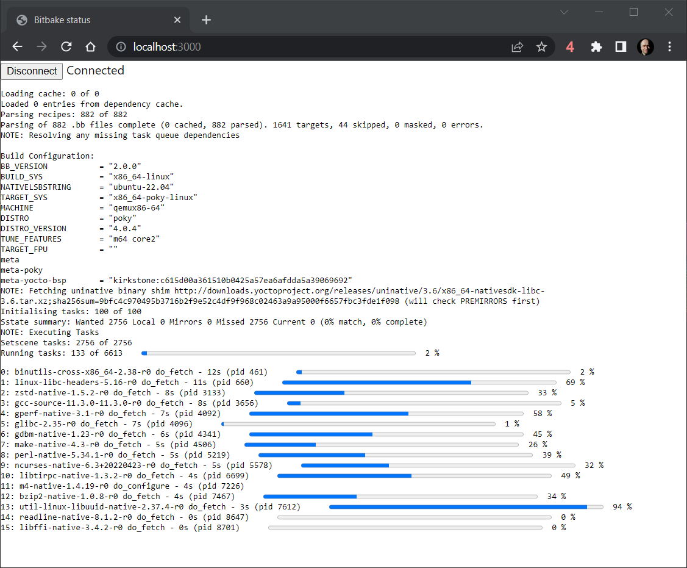

Bitbake - WebKnotty || WebSocket UI Concept
===========================================

This is a fork of Bitbake from OpenEmbedded. The purpose of this repo is to
concept test getting the knotty terminal output to a webpage.

This is implemented by modifying the knotty UI component to connect to an
external WebSocket (WS) server and forward all bitbake events to the connected
server. A small react-based webapp demostrates the bitbake output in
a browser. The app shows progressbars and ongoing activites, like the
interactive knotty terminal. To connect bitbucket with the webapp, a separate
WS server that simply receives the data from bitbake and forwards it to the
connected web clients.

Key components:
 * Knotty UI: [lib/bb/ui/knotty.py](lib/bb/ui/knotty.py)
 * WebKnotty UI (webapp): [contrib/webknotty/](contrib/webknotty/)
 * WS proxy server: [contrib/wsproxy.py](contrib/wsproxy.py)

> **NOTE:** This is a concept test for demonstrating feasibility of a feature.
> This is not production ready code and should not be relied upon.

Installation
------------

This mod requires some additional python packages, and to my opinion the best
way to deal with python packages is through virtual environment. Create
a new venv:

    $ python3 -mvenv venv/
    $ venv/bin/pip install --upgrade pip setuptools   # Optional
    $ venv/bin/pip install -r contrib/webknotty-requirements.txt

The webknotty react webapp needs npm installed (often bundled with 
nodejs) to install the required packages:

    $ cd contrib/webknotty
    $ npm install

Running
-------

In a separate shell, start the WebSocket proxy server by running

    $ venv/bin/python contrib/wsproxy.py

The easiest way to start the webapp is to use the react dev tools to run
a provisional web server:

    $ cd contrib/webknotty
    $ npm start

Open a webbrowser and navigate to http://localhost:3000. It should at this
point be possible to press the 'Connect' button and it should read 'Connected'.

Running bitbake requires one additional step to activate the virtual
environment. This is because the mod of knotty in bitbake requires
a python package which is available in the venv.

    $ source oe-init-build-env
    $ source /path/to/venv/bin/activate

From this point, use bitbake as normal. Observe that the build progress output
in the knotty terminal is shown on the opened web page. The build progress
is shown on the web page even if knotty is not in interactive mode, e.g. when
being run on a server without a console.

------------------------------------

Bitbake
-------

BitBake is a generic task execution engine that allows shell and Python tasks to be run
efficiently and in parallel while working within complex inter-task dependency constraints.
One of BitBake's main users, OpenEmbedded, takes this core and builds embedded Linux software
stacks using a task-oriented approach.

For information about Bitbake, see the OpenEmbedded website:
    https://www.openembedded.org/

Bitbake plain documentation can be found under the doc directory or its integrated
html version at the Yocto Project website:
    https://docs.yoctoproject.org

Contributing
------------

Please refer to
https://www.openembedded.org/wiki/How_to_submit_a_patch_to_OpenEmbedded
for guidelines on how to submit patches, just note that the latter documentation is intended
for OpenEmbedded (and its core) not bitbake patches (bitbake-devel@lists.openembedded.org)
but in general main guidelines apply. Once the commit(s) have been created, the way to send
the patch is through git-send-email. For example, to send the last commit (HEAD) on current
branch, type:

    git send-email -M -1 --to bitbake-devel@lists.openembedded.org

If you're sending a patch related to the BitBake manual, make sure you copy
the Yocto Project documentation mailing list:

    git send-email -M -1 --to bitbake-devel@lists.openembedded.org --cc docs@lists.yoctoproject.org

Mailing list:

    https://lists.openembedded.org/g/bitbake-devel

Source code:

    https://git.openembedded.org/bitbake/

Testing:

Bitbake has a testsuite located in lib/bb/tests/ whichs aim to try and prevent regressions.
You can run this with "bitbake-selftest". In particular the fetcher is well covered since
it has so many corner cases. The datastore has many tests too. Testing with the testsuite is
recommended before submitting patches, particularly to the fetcher and datastore. We also
appreciate new test cases and may require them for more obscure issues.
